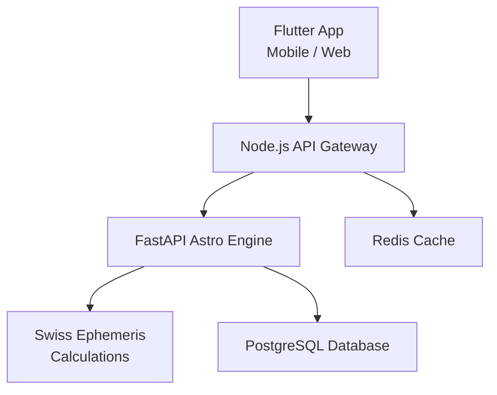

<div align="center">


# ASTRONEXUS

### Modern Astrology & Astronomical Computation Platform

*High-precision ephemeris calculations • Real-time APIs • Cross-platform applications*

[](LICENSE)
[](https://www.python.org)
[](https://fastapi.tiangolo.com)
[](https://flutter.dev)
[](https://nodejs.org)

</div>

---

## 📖 Overview

**ASTRONEXUS** is a modern, scalable astrology and astronomical computation platform that combines high-precision ephemeris calculations with real-time APIs and cross-platform applications. Built with a service-oriented architecture, it provides powerful celestial computation capabilities through an elegant, user-friendly interface.

---

## ✨ Core Features

- 🪐 **High-precision planetary and celestial calculations**
- ⚡ **FastAPI-based scientific computation backend**
- 🌐 **Node.js API gateway and real-time services**
- 📱 **Flutter (Dart) cross-platform mobile & web apps**
- 🏗️ **Modular, service-oriented architecture**
- 🔐 **Secure authentication and role-based access**
- 📊 **Astrological chart generation**
- ☁️ **Cloud-ready deployment**

---

## 🧠 Technology Stack

### Backend – Astro Engine


- **Swiss Ephemeris** for astronomical calculations
- **NumPy** for numerical computations
- **PostgreSQL** for data persistence

### Backend – API Layer


- **Express / NestJS** for API routing
- **WebSockets** for real-time communication
- **Redis** for caching and sessions

### Frontend


- **Material 3** design system
- Cross-platform (iOS, Android, Web, Desktop)

### DevOps


- **Docker** for containerization
- **NGINX** for reverse proxy
- **CI/CD** pipelines

---

## 🏗️ System Architecture



**Architecture Flow:**
```
Flutter App (Mobile / Web)
        │
        ▼
Node.js API Gateway
        │
        ▼
FastAPI Astro Engine
        │
        ▼
Swiss Ephemeris Calculations
```

---

## 📁 Project Structure

```
astronexus/
├── backend/
│   ├── astro_engine/          # Python FastAPI computation engine
│   │   ├── main.py
│   │   ├── requirements.txt
│   │   └── ...
│   └── api_gateway/           # Node.js API gateway
│       ├── src/
│       ├── package.json
│       └── ...
├── frontend/
│   └── flutter_app/           # Flutter cross-platform app
│       ├── lib/
│       ├── pubspec.yaml
│       └── ...
├── docker/                     # Docker configurations
│   ├── Dockerfile.astro
│   ├── Dockerfile.gateway
│   └── docker-compose.yml
├── docs/                       # Documentation
├── scripts/                    # Utility scripts
├── LICENSE
└── README.md
```

---

## 🚀 Getting Started

### Prerequisites

- **Python 3.11+**
- **Node.js 18+**
- **Flutter 3.16+**
- **Docker** (optional, for containerized deployment)
- **PostgreSQL 14+**
- **Redis 7+**

### 1️⃣ Astro Engine Setup

```bash
cd backend/astro_engine
python -m venv venv
source venv/bin/activate  # On Windows: venv\Scripts\activate
pip install -r requirements.txt
uvicorn main:app --reload
```

The Astro Engine will be available at `http://localhost:8000`

### 2️⃣ API Gateway Setup

```bash
cd backend/api_gateway
npm install
npm run dev
```

The API Gateway will be available at `http://localhost:3000`

### 3️⃣ Flutter App Setup

```bash
cd frontend/flutter_app
flutter pub get
flutter run
```

Choose your target platform (iOS, Android, Web, or Desktop)

### 🐳 Docker Deployment

```bash
docker-compose up --build
```

---

## 🔬 Swiss Ephemeris Example

```python
import swisseph as swe

# Set ephemeris data path
swe.set_ephe_path("/ephe")

# Calculate Julian Day
jd = swe.julday(2026, 2, 14, 12.0)

# Calculate Sun position
planet_pos, ret_flag = swe.calc_ut(jd, swe.SUN)

print(f"Sun longitude: {planet_pos[0]:.4f}°")
print(f"Sun latitude: {planet_pos[1]:.4f}°")
```

---

## 🔐 Security Principles

- 🔑 **JWT-based authentication** for secure user sessions
- 🌍 **Environment-based configuration** (never commit secrets)
- 🚦 **Gateway-level rate limiting** to prevent abuse
- ✅ **Strict typing and validation** across all layers
- 🛡️ **CORS policies** properly configured
- 🔒 **HTTPS enforcement** in production

---

## 📈 Roadmap

- [ ] ��� AI-powered astrological insights
- [ ] 📴 Offline ephemeris support
- [ ] 📊 Advanced chart visualization
- [ ] 🌐 Public API ecosystem
- [ ] 🧪 Comprehensive test coverage (>80%)
- [ ] 📱 Native mobile performance optimizations
- [ ] 🎨 Customizable chart themes
- [ ] 📚 Interactive API documentation

---

## 🤝 Contributing

Contributions are welcome! Please feel free to submit a Pull Request. For major changes, please open an issue first to discuss what you would like to change.

1. Fork the repository
2. Create your feature branch (`git checkout -b feature/AmazingFeature`)
3. Commit your changes (`git commit -m 'Add some AmazingFeature'`)
4. Push to the branch (`git push origin feature/AmazingFeature`)
5. Open a Pull Request

---

## 📄 License

This project is licensed under the **MIT License** - see the [LICENSE](LICENSE) file for details.

---

## 📬 Contact & Support

- **Issues:** [GitHub Issues](https://github.com/Va09joshi/astronexus/issues)
- **Discussions:** [GitHub Discussions](https://github.com/Va09joshi/astronexus/discussions)

---

<div align="center">

**Built with ❤️ by the ASTRONEXUS Team**

⭐ **Star this repository if you find it helpful!** ⭐

</div>
